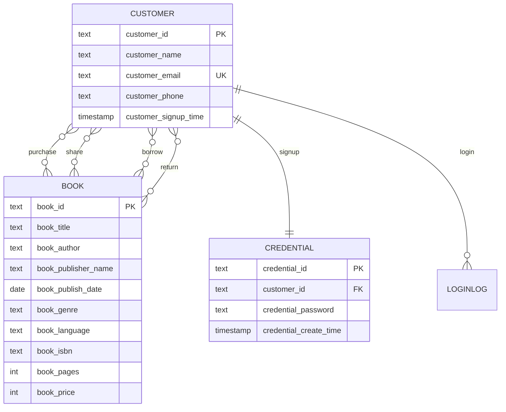
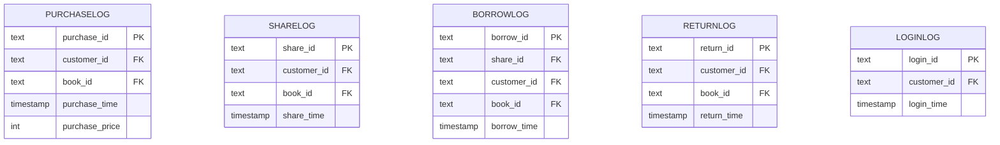

```mermaid
erDiagram
    CUSTOMER }o--o{ BOOK : purchase
    CUSTOMER {
        text customer_id PK
        text customer_name
        text customer_email UK
        text customer_phone
        timestamp customer_signup_time
    }
    BOOK {
        text book_id PK
        text book_title
        text book_author
        text book_publisher_name 
        date book_publish_date
        text book_genre
        text book_language
        text book_isbn
        int book_pages
        int book_price
    }
    
    CUSTOMER }o--o{ BOOK : share
    
    CUSTOMER }o--o{ BOOK : borrow

    CUSTOMER }o--o{ BOOK : return
    
    CUSTOMER ||--|| CREDENTIAL : signup
    CREDENTIAL {
        text credential_id PK
        text customer_id FK
        text credential_password
        timestamp credential_create_time
    }
    CUSTOMER ||--o{ LOGINLOG : login
    
```

```mermaid
erDiagram
    PURCHASELOG {
        text purchase_id PK
        text customer_id FK
        text book_id FK
        timestamp purchase_time
        int purchase_price
    }
    SHARELOG {
        text share_id PK
        text customer_id FK
        text book_id FK
        timestamp share_time
    }
    BORROWLOG {
        text borrow_id PK
        text share_id FK
        text customer_id FK
        text book_id FK
        timestamp borrow_time
    }
    RETURNLOG {
        text return_id PK
        text customer_id FK
        text book_id FK
        timestamp return_time
    }
    LOGINLOG {
        text login_id PK
        text customer_id FK
        timestamp login_time
    }
```
